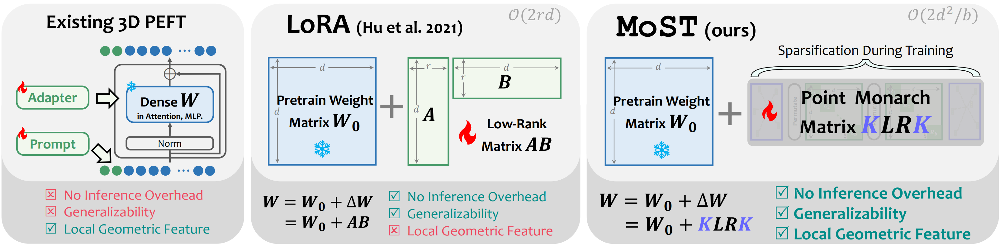

# MoST: Efficient Monarch Sparse Tuning for 3D Representation Learning (CVPR 2025)


[](https://openaccess.thecvf.com/content/CVPR2025/html/Han_MoST_Efficient_Monarch_Sparse_Tuning_for_3D_Representation_Learning_CVPR_2025_paper.html)
[](https://arxiv.org/abs/2503.18368)


This repository contains the official implementation of the paper:

**[CVPR 2025] MoST: Efficient Monarch Sparse Tuning for 3D Representation Learning**

<div style="text-align: center">

</div>

---
<div align="center">
<b>⭐ Star us on GitHub if this project helps you! ⭐</b>
</div>


## 📰 News

- [2025/09] We released a simple implementation of MoST. More code is on the way!
- [2025/04] 🎉 MoST is accepted by CVPR 2025!
- [2025/03] Paper is available on arXiv!

## 📋 TODO
- [x] Release the training and evaluation code based on PointGPT-L
- [x] Release the pretrained weights
- [ ] Implementation based on other models.

## 🎒 Requirements

**Environment**:
Code tested on:
- Ubuntu == 20.04, GCC == 9.4, Python == 3.10
- PyTorch == 2.1.2, CUDA == 11.8

**Installation**:

```bash
# Clone the repository
git clone https://github.com/xhanxu/MoST.git
cd MoST

# Install basic requirements
conda create -n most python=3.10
conda activate most

pip install torch==2.1.2 torchvision==0.16.2 --index-url https://download.pytorch.org/whl/cu118
pip install -r requirements.txt
```

**Install point cloud processing extensions**:
```bash
cd ./extensions/chamfer_dist
python setup.py install --user
cd ../emd
python setup.py install --user

# Install PointNet++
pip install "git+https://github.com/erikwijmans/Pointnet2_PyTorch.git#egg=pointnet2_ops&subdirectory=pointnet2_ops_lib"

# Install GPU kNN
pip install --upgrade https://github.com/unlimblue/KNN_CUDA/releases/download/0.2/KNN_CUDA-0.2-py3-none-any.whl
```

## 🗂️ Datasets

We evaluate MoST on three major 3D point cloud benchmarks:

- **ModelNet40**: Object classification with 40 categories
- **ScanObjectNN**: Real-world point cloud classification (hardest variant)
- **ShapeNetPart**: Part segmentation with fine-grained annotations

For detailed dataset preparation, please refer to [DATASET.md](./DATASET.md).

## 🧪 MoST (PointGPT-L)

### Classification Results
| Dataset | Method | Backbone | Trainable Params | Accuracy | Download |
|---------|---------|----------|------------------|----------|----------|
| ModelNet40 | Full Fine-tuning | PointGPT-L | 360.5M (100%) | 94.1% | - |
| ModelNet40 | **MoST** | PointGPT-L | **8.0M (2%)** | **96.2%** | - |
| ScanObjectNN | Full Fine-tuning | PointGPT-L | 360.5M (100%) | 93.4% | - |
| ScanObjectNN | **MoST** | PointGPT-L | **8.0M (2%)** | **97.5%** | - |


## 🚀 Quick Start

### Pretrained Models

Download PointGPT-L pretrained weights from [here](https://drive.google.com/file/d/1Gc7thuU-D1Sq4NIMTV6-U1LhVN0E2z9l/view).

### MoST Fine-tuning

**Fine-tuning on ModelNet40**:
```bash
bash scripts/run_mn40.sh
```

**Fine-tuning on ScanObjectNN**:
```bash
bash scripts/run_sonn.sh
```

**Custom Training**:
```bash
CUDA_VISIBLE_DEVICES=0 python main.py \
    --config cfgs/PointGPT-L/finetune_modelnet_peft.yaml \
    --exp_name your_experiment_name \
    --ckpts path/to/pretrained/checkpoint.pth
```


## 😊 Acknowledgement
We would like to thank the authors of [Monarch](https://github.com/HazyResearch/fly), [PointGPT](https://github.com/CGuangyan-BIT/PointGPT), and [Point-MAE](https://github.com/Pang-Yatian/Point-MAE) for their great works and repos.

## 😀 Contact
If you have any questions or are looking for cooperation in related fields, please contact [Xu Han](https://xhanxu.github.io/) via xhanxu@hust.edu.cn. 

## 📚 Citation
If you find our work helpful, please consider citing:

```bibtex
@inproceedings{han2025most,
  title={MoST: Efficient Monarch Sparse Tuning for 3D Representation Learning},
  author={Han, Xu and Tang, Yuan and Xu, Jinfeng and Li, Xianzhi},
  booktitle={Proceedings of the Computer Vision and Pattern Recognition Conference},
  pages={6584--6594},
  year={2025}
}
```


## 📄 License

This project is licensed under the MIT License.
